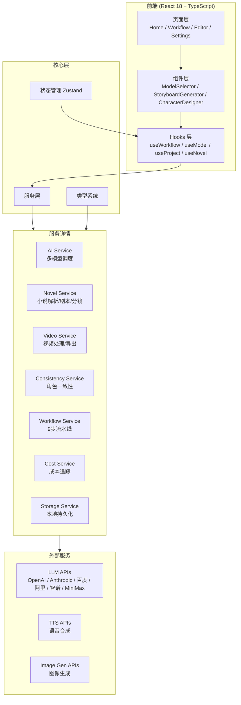

```
  ____ _ _          _    _ __  __
 / ___| (_)_ __    / \  (_)  \/  | __ _ _ __
| |   | | | '_ \  / _ \ | | |\/| |/ _` | '_ \
| |___| | | |_) |/ ___ \| | |  | | (_| | | | |
 \____|_|_| .__//_/   \_\_|_|  |_|\__,_|_| |_|
           |_|
```

<p align="center">
  <strong>ClipAiMan — AI 漫剧视频智能创作平台</strong>
</p>

<p align="center">
  
  
  
  
  
  
</p>

---

## 📖 简介

**ClipAiMan** 是一款专业的 AI 漫剧视频智能创作平台，将小说/漫画内容自动转化为高质量动态漫剧视频。通过 9 步智能工作流，覆盖从文本输入到视频导出的完整创作链路。

> 🎬 **产品定位**：漫剧视频生成（漫画/动漫剧集） ≠ 解说短剧
>
> 📝 **更名历史**：ReelForge → Nova → 漫剧师 → **ClipAiMan** (2026-02-22)

### ✨ 核心优势

- 🤖 **多模型智能调度** — 自动选择最优 AI 模型，支持 OpenAI / Anthropic / 百度 / 阿里 / 智谱 / MiniMax
- 🎭 **角色一致性引擎** — 全剧角色形象、风格、声音保持统一
- 🔒 **原创性保障** — 内容指纹 + 语义去重 + 模板检测，杜绝重复
- 💰 **成本可控** — 实时 Token 统计与 API 用量追踪
- 🖥️ **跨平台桌面应用** — 基于 Tauri，支持 macOS / Windows / Linux

---

## 🔄 9 步智能工作流

InkMotion 的核心是一条完整的 9 步漫剧创作流水线，每步都有明确的输入、处理逻辑和输出。

```
小说上传 → 智能解析 → 剧本生成 → 分镜设计 → 角色设计 → 场景渲染 → 动态合成 → 配音配乐 → 导出发布
```

### Step 1: 📄 小说上传

| 项目 | 说明 |
|------|------|
| **输入** | TXT / EPUB / PDF 格式小说文件 |
| **处理** | 文件解析、编码检测、格式标准化 |
| **输出** | 纯文本内容，存入项目工作区 |

### Step 2: 🔍 智能解析

| 项目 | 说明 |
|------|------|
| **输入** | 纯文本小说内容 |
| **处理** | AI 提取标题、作者、角色、章节结构；评估改编潜力 |
| **输出** | `NovelParseResult` — 结构化数据（角色表、章节列表、摘要） |

### Step 3: 📝 AI 剧本生成

| 项目 | 说明 |
|------|------|
| **输入** | `NovelParseResult` 结构化数据 |
| **处理** | 按章节拆解为场景；生成对白、动作描写、场景描述；估算时长 |
| **输出** | `Script` — 场景化剧本（含角色列表、场景序列、预估总时长） |

### Step 4: 🎬 智能分镜

| 项目 | 说明 |
|------|------|
| **输入** | `Script` 剧本场景 |
| **处理** | AI 拆解每个场景为分镜面板；指定镜头类型（远/中/近/特写）、角度、运动方式 |
| **输出** | `Storyboard[]` — 分镜脚本（含构图描述、镜头语言、AI 绘图 Prompt） |

### Step 5: 🎭 角色设计

| 项目 | 说明 |
|------|------|
| **输入** | 角色列表 + 角色描述 |
| **处理** | AI 生成角色形象；一致性引擎确保全剧风格统一；支持手动调整 |
| **输出** | `Character[]` — 角色卡（外观、性格、配音参数、参考图） |

### Step 6: 🖼️ 场景渲染

| 项目 | 说明 |
|------|------|
| **输入** | 分镜脚本 + 角色卡 |
| **处理** | 根据分镜 Prompt 调用图像生成 API；漫画风格渲染；背景与角色合成 |
| **输出** | 渲染后的场景图片序列 |

### Step 7: 🎞️ 动态合成

| 项目 | 说明 |
|------|------|
| **输入** | 场景图片 + 分镜参数 |
| **处理** | 镜头推拉摇移、表情动画、口型同步、转场效果 |
| **输出** | 动画片段序列 |

### Step 8: 🔊 配音配乐

| 项目 | 说明 |
|------|------|
| **输入** | 剧本对白 + 角色配音参数 + 场景氛围 |
| **处理** | TTS 多角色语音合成；AI 匹配背景音乐；音效叠加；音频混音 |
| **输出** | 完整音轨（对白 + BGM + SFX） |

### Step 9: 📦 导出发布

| 项目 | 说明 |
|------|------|
| **输入** | 动画序列 + 音轨 |
| **处理** | 时间轴编排、音画同步、格式编码、分辨率调整 |
| **输出** | 成品视频文件（MP4 / WebM / MOV，480p ~ 4K） |

---

## 🏗️ 技术架构



---

## 🤖 支持的 AI 模型 (2026)

| 提供商 | 模型 | 用途 |
|--------|------|------|
| **OpenAI** | GPT-5 | 剧本生成、分镜设计 |
| **Anthropic** | Claude 4 | 小说解析、角色设计 |
| **百度** | ERNIE 5.0 | 中文剧本优化 |
| **阿里** | Qwen 3.5 | 通用文本生成 |
| **月之暗面** | Kimi 2.5 | 长文本理解 |
| **智谱** | GLM-5 | 多模态理解 |
| **MiniMax** | M2.5 | 语音合成、配音 |

---

## 🚀 快速开始

### 环境要求

- Node.js ≥ 18
- pnpm 或 npm
- Rust (Tauri 桌面端需要)

### 安装运行

```bash
# 克隆项目
git clone https://github.com/Agions/Manjushi.git
cd Manjushi

# 安装依赖
npm install

# 启动开发服务器
npm run dev

# 构建生产版本
npm run build

# 启动 Tauri 桌面应用
npm run tauri dev
```

### 配置 API 密钥

进入 **设置页面**，配置至少一个 AI 模型的 API 密钥即可开始使用。

---

## 📁 项目结构

```
src/
├── core/                       # 核心层
│   ├── api/client.ts           # 统一 HTTP 请求客户端
│   ├── config/
│   │   ├── app.config.ts       # 应用配置（名称/版本/模型列表）
│   │   ├── models.config.ts    # AI 模型详细配置
│   │   └── optimization.config.ts
│   ├── constants/index.ts      # 全局常量
│   ├── hooks/                  # 业务 Hooks
│   │   ├── useWorkflow.ts      # 工作流管理
│   │   ├── useModel.ts         # 模型选择
│   │   ├── useProject.ts       # 项目管理
│   │   ├── useNovel.ts         # 小说处理
│   │   └── useVideo.ts         # 视频操作
│   ├── services/               # 业务服务
│   │   ├── drama.workflow.service.ts  # ⭐ 9步工作流引擎
│   │   ├── novel.service.ts    # 小说解析/剧本/分镜
│   │   ├── ai.service.ts       # 多模型 AI 调度
│   │   ├── video.service.ts    # 视频处理/FFmpeg
│   │   ├── consistency.service.ts  # 角色一致性
│   │   ├── cost.service.ts     # 成本追踪
│   │   ├── storage.service.ts  # 本地存储
│   │   └── index.ts            # 统一导出
│   ├── stores/                 # Zustand 状态管理
│   ├── templates/              # 分镜/去重模板
│   ├── types/index.ts          # 全局类型定义
│   └── utils/                  # 工具函数
├── components/                 # UI 组件
│   ├── business/               # 业务组件
│   │   ├── ModelSelector/      # 模型选择器
│   │   ├── ScriptGenerator/    # 剧本生成器
│   │   ├── VideoPlayer/        # 视频播放器
│   │   └── editor/             # 编辑器组件
│   ├── common/                 # 通用组件
│   └── layout/                 # 布局组件
├── pages/                      # 页面
│   ├── Home.tsx                # 首页
│   ├── Workflow/index.tsx      # ⭐ 9步工作流页面
│   ├── Editor/                 # 分镜编辑器
│   └── Settings.tsx            # 设置
├── context/                    # React Context
├── layouts/                    # 布局
└── utils/                      # 工具（i18n/PDF导出）

src-tauri/                      # Tauri 桌面端 (Rust)
```

---

## 🛠️ 技术栈

| 类别 | 技术 |
|------|------|
| **前端框架** | React 18 + TypeScript 5 |
| **构建工具** | Vite 4 |
| **UI 组件** | Ant Design 5 |
| **状态管理** | Zustand 4 |
| **动画** | Framer Motion |
| **样式** | Less + CSS Modules |
| **桌面端** | Tauri (Rust) |
| **代码规范** | ESLint + Prettier |
| **包管理** | pnpm / npm |

---

## 🤝 参与贡献

1. Fork 本仓库
2. 创建特性分支 (`git checkout -b feature/amazing-feature`)
3. 提交更改 (`git commit -m 'feat: add amazing feature'`)
4. 推送分支 (`git push origin feature/amazing-feature`)
5. 提交 Pull Request

### 提交规范

- `feat:` 新功能
- `fix:` 修复
- `docs:` 文档
- `refactor:` 重构
- `style:` 样式
- `test:` 测试

---

## 📄 许可证

本项目采用 [MIT License](./LICENSE) 开源。

---

<p align="center">
  <strong>ClipAiMan</strong> — 让每一帧都有灵魂
</p>
